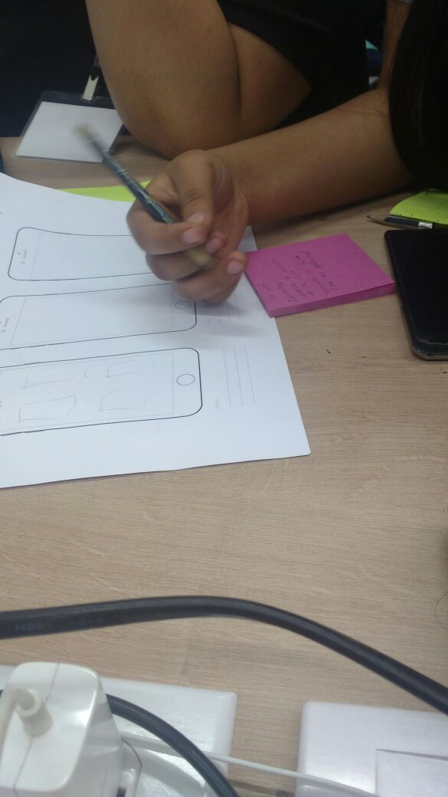
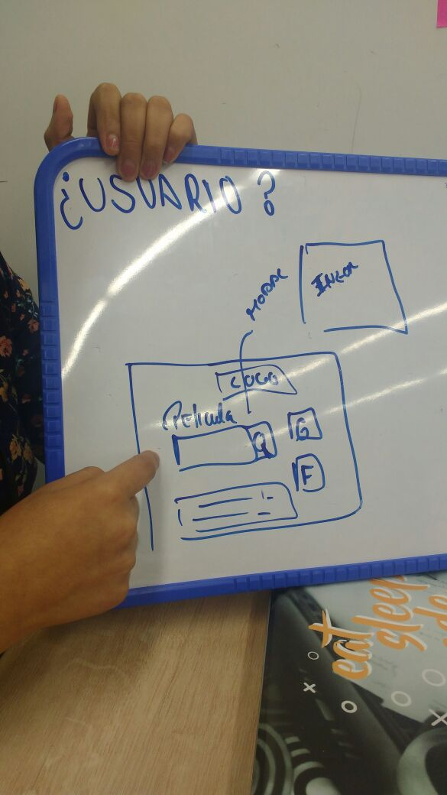
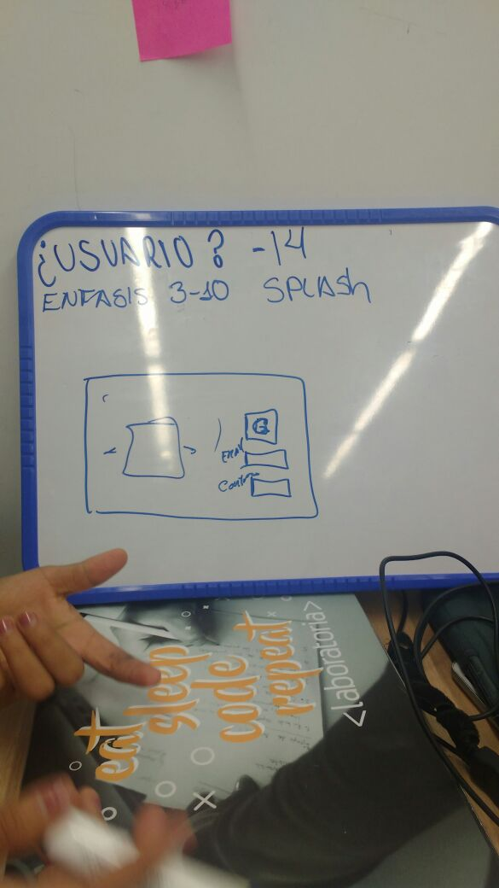
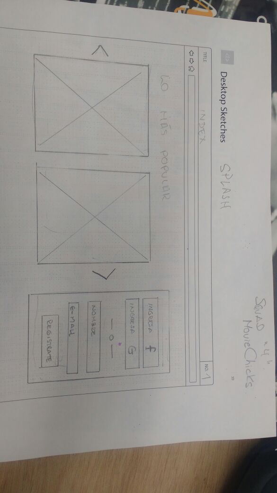
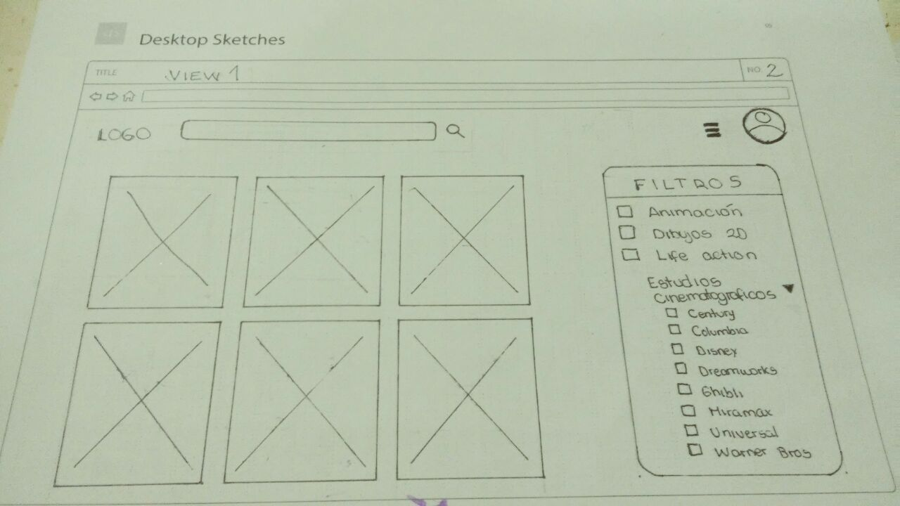
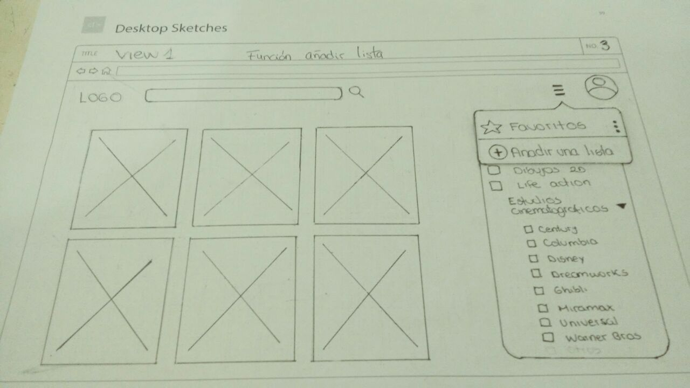
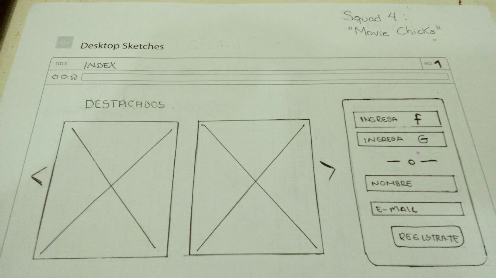

# movie app

Reto: Desarrollar  un app con tématica sobre el consumo de películas y el desarrollo de soluciones/productos.

Squad 4 "Movie Chicks" integrado por
- Yanira Arenazas
- Jessica Meza
- Nataly Ortiz
- Daphne Cáceres

Recursos empleados en el desarrollo del reto:
- Planificación del proyecto: Trello, Balsamiq Cloud
- Desarrollo e implementación: javascript, jQuery, Bootstrap 4
- Backend: Firebase

+ Sesión 1 día 16/01/2018
Coordinación entre las integrantes del equipo, mediante lluvia de ideas para la elección de una problématica no solucionada de los
consumidores de cine promedio. Se escogió desarrollar un aplicativo que facilite la elección a padres y cuidadores primarios de niños y
niñas con edades entre los 2 y 10 años, de películas teniendo con enfásis en la edad del y gustos de los usuarios objetivo, la usabilidad y la fácil
empleabilidad del producto.

+ Se asigna el área de trabajo de las integrantes de la siguiente manera:
- Yanira Arenazas y Jessica Meza: documentación y desarrollo utilizando javascript, JQuery
- Nataly Ortiz: Maquetado con Bootstrap
- Daphne Cáceres: Sketchado y testeo de los primeros drafts
 
 

 
 

 + Logros obtenidos dentro de cada área trabajada el día 16/01/2018
 Yanira Arenazas y Jessica Meza: Recobro de data desde OMDb API: http://www.omdbapi.com/?i=tt3896198&apikey=992446a3
 Nataly Ortiz: maketado de vista index. Diseño de Logo y paleta de colores
 Daphne Cáceres: Investigación de productos similares en el mercado local, elaboración de preguntas para el testeo del sketch del producto aplicada a 5 madres de familia con niños en edades entre 2 y 10 años.
